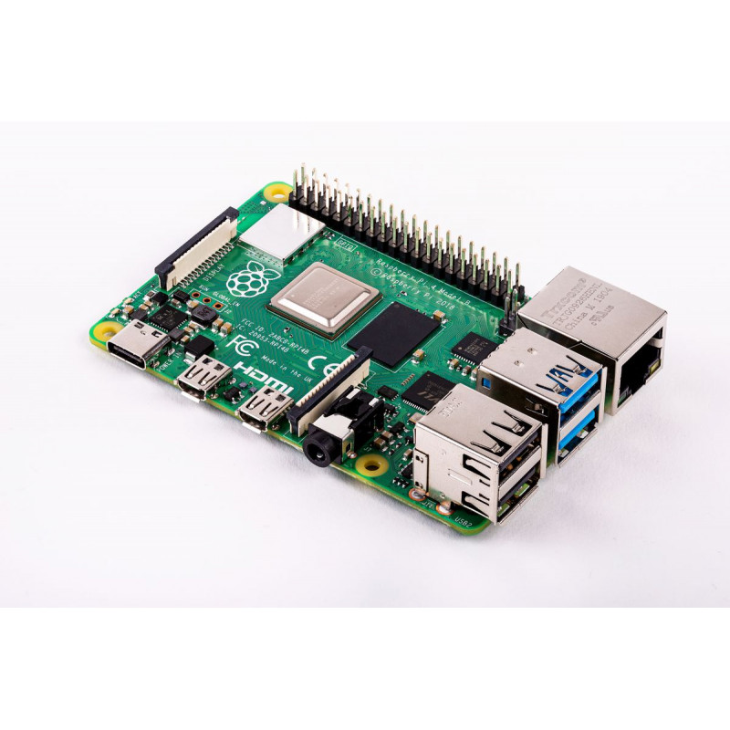

# Smart PLC Runtime (SPLC runtime)

The SPLC Runtime executes PLC programs on compact devices like Raspberry Pi.
The runtime uses MATIEC compiler to generate ANSI- C codes from the .st file
(IEC61131 format) fed into it.

## Shunya Stack
Project is built by using the Shunya stack.

-   ShunyaOS is a lightweight Operating system with built-in support for AI and IOT.
-   Shunya Stack Low Code platform to build AI, IoT and AIoT products, that allows you to rapidly create and deploy AIoT products with ease.

For more information on ShunyaOS see : http://demo.shunyaos.org

## Documentation
For developers see detailed Documentation on the components of the project in the [Wiki](https://gitlab.iotiot.in/newbies/project-internship-oct/splc-runtime/wikis/home)

## Project Overview

1.  [Project Plan Excel](https://docs.google.com/spreadsheets/d/16jX74t-u21wTPv5YkvgxhUK2YpPRJitrxIQ7DE3mzsU/edit?usp=sharing)
1.  [Get a birds-eye status of the project](https://gitlab.iotiot.in/newbies/project-internship-oct/splc-runtime/milestones)

## Contributing
Help us improve the project.

Ways you can help:

1.  Choose from the existing issue and work on those issues.
2.  Feel like the project could use a new feature, make an issue to discuss how it can be implemented and work on it.
3.  Find a bug create an Issue and report it.
4.  Review Issues or Merge Requests, give the developers the feedback.
5.  Fix Documentation.